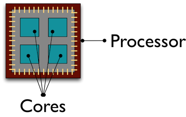
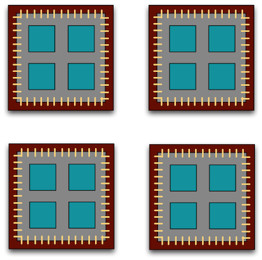
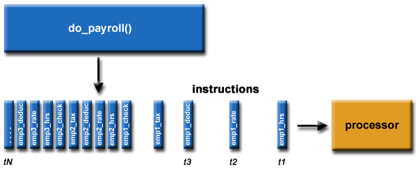
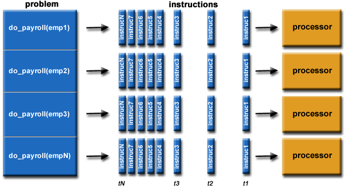
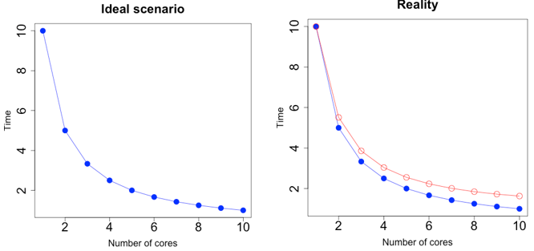
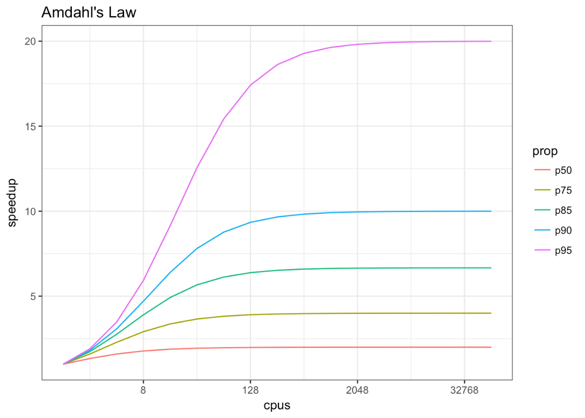

```{r setup, include=FALSE}
knitr::opts_chunk$set(echo = TRUE,
                      warning = FALSE,
                      message = FALSE,
                      cache = TRUE,
                      results = "markup")

#setwd("C:/Users/Elana/Documents/All My Stuff/Brown/Stats/Practical Data Analysis/Final Project")

library(parallel) #parallel processing
library(MASS) #stepAIC
library(broom) #glance
library(boot) #bootstrap
library(dplyr)
library(tidyverse)
library(knitr)
library(kableExtra)

```

# Background:

There are a lot of people in the world with all kinds of credit loans, car loans, home loans, etc. As a result, there are all kinds of data associated with a banking corporation. In my experience working in a banking corporation, working with credit loans alone, one could regularly work with datasets of over 19 million observations (terabytes of data). With a dataset this large, seemingly trivial tasks like reading in the data that could be virtually instant with a smaller dataset could take hours. This wait time only increases when trying to perform more complicated tasks such as bootstraps and cross validations (let alone with repeated processes).  

It is crucial that banks regularly monitor the behavior of loan payments, analyze any associated models, and continuously prepare for the future and any unforseen economical changes. In this context, efficiency becomes extremely important. The difference between an efficient program and an inefficient program could be a whole 48 hours for one run (let alone if there end up being mistakes in your code!). 

In the name of efficiency and productivity in the workplace, we turn to parallel processing, a method of making our code run faster. There are all kinds of clever coding techniques that not only read better, but also can make our code more streamlined, and it is important to use these as optimal coding techniques and best practices. However, it is also possible to use the very hardware of our computers to make our code run faster, and when working with thousands of very large datsets, computer capabilities and machinery becomes very refined and advanced. It is very beneficial, especially in the financial setting, to use this extra computing power to execute tasks quickly so that important information about the public's finances can be obtained. 

In this basic tutorial, we will discuss how parallel processing works, its advantages and pitfalls, and work through how to implement parallel processing in R. When using it the right way, parallel processing can be extrememly effective in getting more done faster. 

# A Little About Computers:

All computers have a central processing unit (CPU) at the heart of all of its operations. This is a crucial part of computers that processes computations. A CPU also contains cores, which computations run through. Traditionally, computers had one CPU with one core, but nowadays computers can have multiple processors and each processor can have multiple cores. These processors and cores are used together to perform computations. See a figure of a common CPU below. 

```{r, echo = F, fig.cap="A Quad Core Processor"}



```

Above we have a quad core processor. This means we have one CPU with four cores. This allows four computations to be processed simultaneaously. 

As said before, traditional computers had only one processor, but now modern computers can have multiple processors with multiple cores. A typical laptop can have around 2 to 4 cores per processor while high performance computer clusters could have thousands of cores. 

Below we have four quad-core processors for a total of 16 cores. This will allow 16 computations to happen at the same time, in theory allowing computations to take 1/16^th^ of the time (although this is not exact, as we will discuss later).



# What is Parallel Processing?

Parallel processing is a method of utilizing multiple cores simultaneously to speed up processing times. The way this method works is the following:

  - A problem (or function) is broken into discrete and independent parts that can be solved concurrently
  - Each part is broken down further into instructions
  - Instructions from each part execute simultaneously on different cores
  
By splitting up one task into multiple parts and sending each part to a different core, it's as if we are utilizing multiple computers for one problem, instead of sending the task to one core to be processed one instruction at a time.

Consider the following examples.

## Serial Processing - An Example



Above we see a common example of serial processing, the opposite of parallel processing. With serial processing, each individual instruction and part of a problem or function is ran one instruction at a time, causing very long wait times. In the above example, we have one overall task *do_payroll()*, and that task has multiple "parts" or, in this case, employees. For each employee, there is a set of instructions, or attributes, needed to calculate that individual employee's payment such as hours worked, taxes, deductions, etc. 

In serial processing, we would perform *do_payroll()* for each employee one at a time. As the number of employees increases, it is easy to see how this method of carrying out our task, although correct, is very inefficient, and can cause a huge backlog of jobs. 

## Parallel Processing - An Example

Now let's look at what happens if we were to parallelize this operation:



With parallel processing, we have broken up our *do_payroll()* function into multiple discrete and independent parts, or employees. Then, we send the necessary instructions, or attributes, of each employee to a different core to be processed (please note that a lot of places use the words "processor" and "core" interchangeably). In this way, we can get through all employees much faster than if we were to run through each of them, one employee at a time. 

# When Should We Use Parallel Processing?

Parallel computing is most beneficial when tasks are "embarrassingly parallel" (also known as perfectly parallel, delightfully parallel, or pleasingly parallel). This means that there are no dependencies between parallel tasks or results, and each part can be computed in isolation from the others. 

Some common embarrassingly parallel tasks include:

  - Applying a function to each element of a list or matrix
  - Bootstrapping
  - Cross-Validation
  - Monte Carlo Simulation
  
All of these tasks are ones in which repetitive tasks are performed, each independent from each other. 

Although multiple cores allow computations to be sped up, it is not exactly propoortional to the additional cores. This is because of the overhead involved in implementing parallel processing. To utilize multiple cores, the code and the data need to be copied to each additional CPU, and this takes time. This overhead reduces efficiency enough that realistic performance gains is much less than theoretical performance gains. See the below figure as an example:



Some believe that the speedup involved with implementing parallelization follows Amdahl's Law, shown below. The benefits of parallelization are a function of both the amount of cores being used and the proprtion of code that is able to be parallelized. As the number of CPUs continuously increases, the benefits of parallelization begins to decrease because of the overhead costs involved with implementation. 



In general, if each computation on its own is relatively fast, it may not be useful to utilize parallel processing. In fact, it may even make your code slower! What we want to parallelize are the serious bottlenecks in our code that would highly benefit from being run simultaneously.

# Parallel Processing in R

By default, R uses only one CPU and one core, meaning it is a very single-threaded programming language. This creates a great deal of serial processing. However, let's see the processing power the Windows 10 OS laptop computer this report is written on actually has:

```{r cpus_cores}

cpus <- detectCores(logical=F)
cores <- detectCores(logical=T)

data.frame(CPUs = cpus, Cores = cores)
```

It would be great if R could utilize these extra processors and cores, so let’s see how to parallelize code in R!

There are several packages available in R for the use of parallelization, including, but not limited to:

  - parallel
  - foreach
  - doParallel
  - BiocParallel
  
All are geared at utilizing multiple cores for computations. For this report, we will utilize the **parallel** package.   

## Loops vs. the apply Family of Functions

We’ve previously learned that *for* loops are generally not preferred when performing repetitive tasks. This is because they are highly serial, meaning they perform each computation one at a time through one core. This greatly reduces processing speed, and when working with very large amounts of financial data as described in the beginning of this report, processing speeds are very important.

A common alternative to the *for* loop is the *apply* family of functions (*lapply*, *sapply*, *apply*). These functions are typically considered faster than *for* loops as they implement a method of vectorization instead of the usual serial processing. 

Let's see an example of how the *apply* function can be used as an alternative to the *for* loop. 

## A Simple Example

Consider the pain and weather data from the beginning of the semester.

```{r for_loop1, echo = F}

mcalindon.dat <- read.csv("C:/Users/Elana/Documents/All My Stuff/Brown/Stats/Practical Data Analysis/Final Project/McAlindon_Big.csv")
runs.vals <- rle(mcalindon.dat$ID)
row.nums <- cumsum(runs.vals$lengths) + 1
mcalindon.dat_first <- mcalindon.dat[c(1, row.nums),]
mcalindon.dat_first <- mcalindon.dat_first[-206,]
pains.dat <- na.omit(mcalindon.dat_first[,c("ID", "pain.1", "pain.2", "pain.3", "pain.4", "pain.5", "pain.6", "pain.7")])

```

```{r for_loop2}

head(pains.dat)

```


One task was to find the average pain score at each recorded time. In terms of the dataset shown above, that means finding the mean of each column of data. There are several ways we could do this. See a use of the *for* loop below.

### *for* Loop

```{r for_loop3}

# create place to store average pains
avg.pains <- matrix(NA, 7, 1)

# use for loop to calculate means
for (i in 1:ncol(pains.dat)-1) {
  
  col.mean <- round(mean(pains.dat[,i+1]),3)
  avg.pains[i,1] <- col.mean

}

avg.pains

```

### *apply* Function

We can do the same thing with an *apply* function, utilizing vectorization.

```{r lapply1}

# do the same thing with standard apply
avg.pains <- apply(pains.dat[,-1], 2, mean)

as.matrix(round(avg.pains,3))

```


### Parallelization

For this report, we will utilize the **parallel** package. Parallel processing in R via the **parallel** package expands upon the *apply* family of funtions. It still uses the general concept of vectorization to break up our problem as *apply* does, but it allows processes to be distributed among multiple cores of our computer. 

But how do we actually implement parallel processing?

Well, first, we must initiate a cluster of cores. As shown above, even though R traditionally utilizes only one core of this computer, there are several left over. So, let's use some of them and group them together into a cluster!

**Tip:** Don’t use all the cores, we still want to use the computer!

```{r parallel1}

# Calculate the number of cores
cores <- detectCores() - 1

# Initiate cluster
cluster <- makeCluster(cores)

cores
```

Once we’ve initiated our cluster, we can use the parallel version of the *apply* function, *parApply*, to perform our task. This will spread out our computation among the 7-core cluster we have created. 

```{r parallel2}

# use the parallel modification of the apply function
# parApply
avg.pains <- parApply(cluster, pains.dat[,-1], 2, mean)

as.matrix(round(avg.pains,3))

```

We must be sure to always stop the cluster when we're done with our computations. This frees up our cores for other tasks on our computer. It also frees up memory being taken up. 

```{r parApply3}

# always stop the cluster when done
stopCluster(cluster)

```

## Performance Time – A More Complicated Example

Let’s see how well the *for* loop, *apply* function, and *parApply* parallel method perform in terms of processing speed. To do this, we will use an example directly from our homework.

Consider the ‘iodatadev.csv’ dataset on GFR levels. In a past homework, we were asked to calculate a bootstrapped estimate of the $R^2$ value of a stepwise regression model we were tasked with specifying. Bootstrapping is an example of an "embarrassingly parallel" task, meaning each bootstrap sample that instructions will be performed on are independent from the rest. In this case, parallel processing could be highly beneficial. 

**NOTE:** We are using the **MASS** package to define the stepwise regression model and the **broom** package to obtain its $R^2$ value. We will also use the base R *system.time()* function to time the total computation. 

```{r kidney_data, echo = F}

#read in the data
kidney <- read.csv("iodatadev.csv")

#select variables of interest
kidney <- kidney %>%
  dplyr::select(WEIGHT,BMI,GFR,UCRE,UUN,UPHO,SUN,SCR,
                TCHOL,ALB,HBA1C,PHOS,TRIG,LDL,HDL,HB,
                MAP,upro,BSA,SODIUM,GLUC,BLACK,HEIGHT,
                AGE,FEMALE,cys,DBP,SBP,CRP,Diabetes,hbpstatus
                )

#get indeces of vars to remove
remove <- which(colnames(kidney) %in%
                  c("UPHO","HBA1C","TRIG",
                  "LDL","HDL","hbpstatus",
                  "WEIGHT", "HEIGHT", 
                  "DBP", "SBP", "SUN", "cys"))

#remove these indeces from the kidney dataset
#remove missing values
kidney.dat <- na.omit(kidney[,-remove])

```

### *for* Loop

```{r for_loop}

set.seed(48)

#repeat 10000 times
loops <- 1000

#create place to store r2
r2 <- matrix(NA,1000,1)

#start timer for the loop
system.time({
for (i in 1:loops) {
  
  #get some samples with replacement
  #subset to just a few hundred for time
  indices <- sample(1:nrow(kidney.dat),nrow(kidney.dat),replace = T)
  
  #define fully specified model
  full_mod <- lm(GFR~., data = kidney.dat[indices,])
  
  #define stepwise model
  step_mod <- stepAIC(full_mod, direction = "both", 
                      trace = FALSE)
  
  #return R^2 value of stepwise model
  rsq.train <- glance(step_mod)$r.squared
  
  #store it
  r2[i,1] <- rsq.train
  
}})

```

The *for* loop took almost 4 whole minutes to run the 1000 bootstrap samples. That is a long time to sit and wait to do anything else with our analysis even for this relatively small dataset. When working with larger financial data, this wait time exponentially increases.

### *lapply* Function

Now let's use the *lapply* function to see if it is any faster. 

```{r lapply}

set.seed(48)

#define sequence of bootstraps
boots <- seq(1, 1000)

#define function that returns r2
rsq.fx <- function(boot) {

  indices <- sample(1:nrow(kidney.dat),nrow(kidney.dat),replace = T)
  full_mod <- lm(GFR~., data = kidney.dat[indices,])
  step_mod <- stepAIC(full_mod, direction = "both", 
                      trace = FALSE)
  rsq.train <- glance(step_mod)$r.squared
  return(rsq.train)
  
}

system.time({
    rsq <- lapply(boots, rsq.fx)
})

```

The *lapply* function has slightly decreased performance time. However, this decrease is very marginal. Although in some situations vectorization via *apply* leads to quicker results, it generally performs similarly to a *for* loop. This is because the *for* loop has been drastically optimized by its developers to address this issue of processing time differences. So, in a way, it is kind of a myth that the *apply* function is faster. It is, however, definitely cleaner code. 

### Parallelization

```{r parLapply}

cores <- detectCores()-1

system.time({

    cluster <- makeCluster(cores)
    
    #set parallel seed
    clusterSetRNGStream(cluster,48)
    
    boots <- seq(1, 1000)
    
    #export necessary variables so function can see them
    clusterExport(cluster, c("boots","kidney.dat"), envir = environment())
    #export necessary libraries so function can see them
    clusterEvalQ(cluster, 
                 c(library(MASS), library(broom)))
    
    rsq.fx <- function(boot) {
    
      indices <- sample(1:nrow(kidney.dat),nrow(kidney.dat),replace = T)
      full_mod <- lm(GFR~., data = kidney.dat[indices,])
      step_mod <- stepAIC(full_mod, direction = "both", 
                          trace = FALSE)
      rsq.train <- glance(step_mod)$r.squared
      return(rsq.train)
      
    }
    
    rsq <- parLapply(cluster, boots, rsq.fx)
})

stopCluster(cluster)

```

Using the parallelization method has cut processing time by 63%! 

Even though we have distributed our task among 7 cores, we don’t quite yield 1/7^th^ of the processing time. This is due to overhead costs of implementing parallelization. The reduction is still useful, however, especially on a large scale. 

## Final Example Utilizing the *boot* Function

Let’s consider the same problem from before, but utilizing the *boot* function from the R package **boot**. The *boot* function is highly optimized, and has an option for whether to implement parallelization. Because *boot* has been highly optimized by its developers, we may use it instead of a user defined bootstrapping function.

Parallelization may or may not hinder this optimization due to overhead costs. Let's try it out!

### *boot* Function Without Parallelization

```{r boot1}

#define function for boot function
#returns r2
rsq.boot.fx <- function(data, index) {
  
  kid <- data[index,]
  full_mod <- lm(GFR~., data = kid)
  step_mod <- stepAIC(full_mod, direction = "both", 
                      trace = FALSE)
  rsq.train <- glance(step_mod)$r.squared
  
  return(rsq.train)
  
}

#run the boot function without parallelization
set.seed(48)

system.time({
    rsq.boot <- boot(kidney.dat, rsq.boot.fx, 1000)
})

```

Interestingly enough, this *boot* function ran actually *slower* than our original *for* loop. However, this decrease in speed is very marginal, and it is probably safe to assume that the *boot* function and *for* loop perform relatively similarly (as with the *apply* function).

### *boot* Function With Parallelization

Let's try implementing the option of parallelization within the *boot* function. 

```{r boot2}

#run the boot function with parallelization
set.seed(48)

system.time({
    rsq.boot <- boot(kidney.dat, rsq.boot.fx, 1000,
                     parallel = "snow", cl = cluster)
})

```

When specifying the use of parallelization, our computation actually took longer to process. This is an example of when the overhead costs of parallelization are not worth the extra processing power. Because the *boot* function is already highly optimized, its computation time without parallelization is already fast. In this case, the costs of copying the code and the data to each CPU for the parallel processing is too great to make any real positive efficiency difference. Again, it is important before implementing methods like this that we case our data, problem, and function for truly beneficial parallel processes.

# Conclusion

Let’s see how each method did in terms of processing time for our bootstrapping example:

```{r conclusion, echo = F}

methods <- data.frame(Method = c("boot w parallel", 
                                 "boot w/o parallel",
                                 "for loop",
                                 "lapply",
                                 "parLapply"),
                      "Total Time" = c(270.03,231.51,228.41,227.86,77.16))

kable(methods, booktabs = T, caption = "Different Processing Times") %>%
  kable_styling(latex_options = c("striped", "HOLD_position"))

```

From the above table, it seems that the *boot* function without parallelization, the *for* loop, and the *lapply* function all performed relatively similarly in terms of processing time. It may be that prior optimizations in our R program have caused these three methods to all be similar in their computative efficiency. Furthermore, given the size of our datset in this example, we may not have been able to see any real difference in processing time. When implementing parallelization within the boot function, it seems the overhead costs involved markedly decreased our efficiency. This could be due to the underlying structure of the *boot* function. When utilizing the parallel function *parLapply*, however, we saw a significant decrease in performance time, about 63\%! This shows that using parallelization to optimize our code can be extremely beneficial in terms of wait times. 

In this project, we have overviewed:

-	Instances of long processing times in the real world
-	Computer architecture, CPUs, and cores
-	How parallel processing works
-	When to use parallel processing
-	An introduction to parallel processing in R

Hopefully this report has shed some light on the advantages and disadvantages of parallel processing, and can serve as an introduction on how to implement the powerful method in our own code!

# References

  - “A No BS Guide to the Basics of Parallelization in R.” 2016. https://www.r-bloggers.com/a-no-bs-guide-to-the-basics-of-parallelization-in-r/
  
  - Barney, Blaise. “Introduction to Parallel Computing.” 2019. https://computing.llnl.gov/tutorials/parallel_comp/#Whatis

  - Collado-Torres, L. “Are you doing parallel computations in R?” 2018. http://lcolladotor.github.io/2016/03/07/biocparallel/#.Xevl2ehKhPZ

  - Errikson, Josh. “Parallel Processing in R.” http://dept.stat.lsa.umich.edu/~jerrick/courses/stat701/notes/parallel.html

  - Gordon, Max. “How-to go parallel in R – basics + tips.” 2015. http://gforge.se/2015/02/how-to-go-parallel-in-r-basics-tips/

  - Jones, Matt. “Quick Intro to Parallel Computing in R.” 2017. https://nceas.github.io/oss-lessons/parallel-computing-in-r/parallel-computing-in-r.html

  - Mount, John. “A gentle introduction to parallel computing in R.” 2016. http://www.win-vector.com/blog/2016/01/parallel-computing-in-r/

  - Oehm, Daniel. “Simple Parallel Processing in R.” 2018. https://www.r-bloggers.com/simple-parallel-processing-in-r/

  - Springate, David. “Speeding up your R code.” http://rstudio-pubs-static.s3.amazonaws.com/5526_83e42f97a07141e88b75f642dbae8b1b.html

